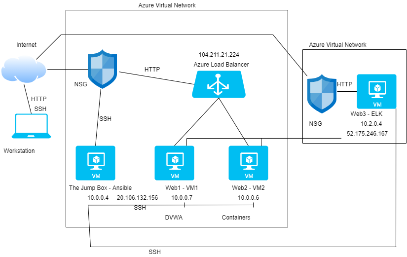
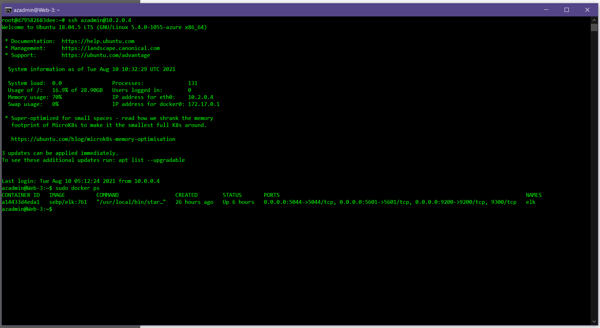
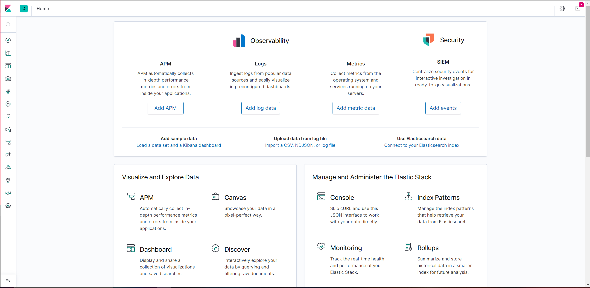

# ELK-Monitoring-Solution
Project 1

## Automated ELK Stack Deployment

The files in this repository were used to configure the network depicted below.

These files have been tested and used to generate a live ELK deployment on Azure. They can be used to either recreate the entire deployment pictured above. Alternatively, select portions of the (YAML) file may be used to install only certain pieces of it, such as Filebeat.

  - my-playbook.yml
  - elk-playbook.yml
  - filebeat-playbook.yml
  - metricbeat-playbook.yml
  - hosts.txt

This document contains the following details:
- Description of the Topology
- Access Policies
- ELK Configuration
  - Beats in Use
  - Machines Being Monitored
- How to Use the Ansible Build

### Description of the Topology

The main purpose of this network is to expose a load-balanced and monitored instance of DVWA, the D*mn Vulnerable Web Application.

Load balancing ensures that the application will be highly (available), in addition to restricting (access) to the network.
- What aspect of security do load balancers protect? From DDOS attacks 
- What is the advantage of a jump box? Accessing your home network from remote locations

Integrating an ELK server allows users to easily monitor the vulnerable VMs for changes to the (jumpbox) and system (network).
- What does Filebeat watch for? Log Data
- What does Metricbeat record? Operating system metrics such as CPU or memory data related to services running on the server

The configuration details of each machine may be found below.

| Name     | Function | IP Address | Operating System |
|----------|----------|------------|------------------|
| Jump Box | Gateway  | 10.0.0.4   | Linux Ubuntu     |
| Web1     | VM -1    | 10.0.0.6   | Linux Ubuntu     |
| Web2     | VM -2    | 10.0.0.7   | Linux Ubuntu     |
| Web3     | Elk Stack| 10.2.0.4   | Linux Ubuntu     |

### Access Policies

The machines on the internal network are not exposed to the public Internet. 

Only the (JumpBox) machine can accept connections from the Internet. Access to this machine is only allowed from the following IP addresses:

- IP 203.29.152.103

Machines within the network can only be accessed by the Jump Box
- Private IP 10.0.0.4
- Public IP 20.106.132.156

A summary of the access policies in place can be found in the table below.

| Name     | Publicly Accessible | Allowed IP Addresses |
|----------|---------------------|----------------------|
| Jump Box | Yes - SSH 22        | 10.0.0.6 10.0.0.7    |
| Web1     | No                  | 10.0.0.4             |
| Web2     | No                  | 10.0.0.4             |
| Web3-ELK | Yes Port 5601       | -                    |
  
### Elk Configuration

Ansible was used to automate configuration of the ELK machine. No configuration was performed manually, which is advantageous because of its Minimal and automation work done to install multiple files to multiple virtual machines through sequence of commands.

The playbook implements the following tasks:
- Install Docker.io
- Install Python3
- Install Docker via python Module
- Download and Launch Docker Container with ELK image
- Enable Docker Service on boot

The following screenshot displays the result of running `docker ps` after successfully configuring the ELK instance.

### Target Machines & Beats
This ELK server is configured to monitor the following machines:
- VM1 - 10.0.0.6
- VM2 - 10.0.0.7
- ELK - 10.2.0.4

We have installed the following Beats on these machines:
- VM1 & VM2 Filebeats & MetricBeats

These Beats allow us to collect the following information from each machine:
- Filebeat – Collects and Log Event Files
- Metricbeat - Collects and reports various system-level metrics for various OS systems and platforms

### Using the Playbook
In order to use the playbook, you will need to have an Ansible control node already configured. Assuming you have such a control node provisioned: 

SSH into the control node and follow the steps below:
- Copy the (elk-playbook.yml) file to /etc/ansible/.
- Update the (hosts) file to include (webserver) & (elk)
- Run the playbook, and navigate to (URL) http://localhost:5601/app/kibana to check that the installation worked as expected.

_TODO: Answer the following questions to fill in the blanks:_
- Which file is the playbook? filebeat-config.yml  Where do you copy it? /etc/ansible
- Which file do you update to make Ansible run the playbook on a specific machine? hosts file
- How do I specify which machine to install the ELK server on versus which to install Filebeat on? On the Hosts files – Elk has its own server and Filebeats is to be installed on the (Webservers)
- Which URL do you navigate to in order to check that the ELK server is running? http://localhost:5601/app/kibana

_As a **Bonus**, provide the specific commands the user will need to run to download the playbook, update the files, etc._
 - curl command the following playbooks for either Filebeat or Metricbeat to download the playbook
 - edit hosts file to update your IP address
 - to run the playbook: ansible-playbook filebeat-playbook.yml 